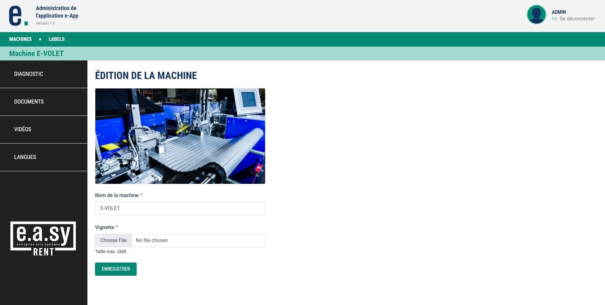
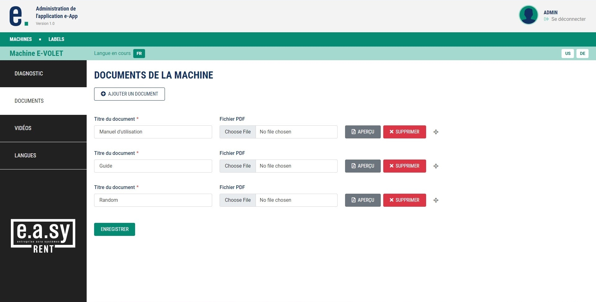
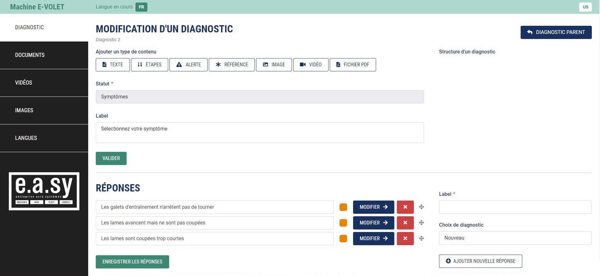
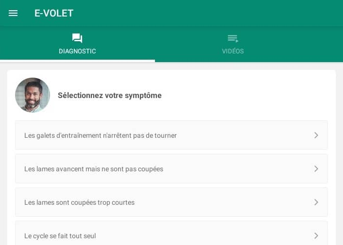

### My role

I was in charge of the development of all the features inside the back-office and I also participated in the deployment of the project on the online server.

### Overview

A back-office designed to manage the content of the e-App. The main goal is to provide new content to the mobile app through regular updates. This includes things like new machines, new languages, documentation or new guides.

### Preview

### Challenge

One of the hardest things was designing and developing the extensive system for content management of the diagnostic tool. A lot of thought went into every aspect of this part. Different types of content inside the chat were considered and the structure had to remain quite simple. The back-office admin was supposed to be able to link each step of the guide to any previously created answer. Other things like links to videos, images or documentation and the order of appearance also had to be taken into account.

On top of that, the e-App was designed to handle multiple languages, so there needed to be a way to be able to deliver content to the app in different languages. It wasn't a difficult task for the other sections of the back-office, but it turned out to be a challenge for the diagnostic tool where there were already a lot of moving parts. Moreover, the back-office had to be developed in a short time, right after the e-App was finished.

### Solution

It was decided to use [Symfony](https://symfony.com/), a very well-known PHP framework. Symfony provides lots of neat web components, is really fast, scalable and reliable. With a framework like Symfony, it's not difficult to set up many features that would take more time if done from scratch. For instance, a simple and secure authentication system can be achieved in a few minutes.

Most of the sections inside the back-office were quite simple - most of them are typical forms with few text inputs and file uploads. Each important section in the back-office corresponds to its counterpart in the mobile app (e.g. documentation or videos screens). Moreover, in each section, the user can switch between any of the languages that he has previously added.

The diagnostic tool section consists of several forms inside a large form, in Symfony it is referred to as nested forms or collection of forms. This part was crucial as it allowed for multiple parts of the "diagnostic system" in a single form which was supposed to be equal to one step inside the chat-like guide.

It may look confusing or overwhelming at first, but it's nothing complicated once you understand the whole concept. The screenshot above translates into the following screen from the app :

Apart from the main sections, there are also two smaller but still very important ones. The first one is dedicated to Labels inside the e-App, so that the user interface remains consistent with the rest of the application content. The other one includes an user interface to export all the data gathered from the guides, into a spreadsheet for further analysis (as the user is guided through the steps and instructions inside the mobile app, each answer chosen by the user is recorded in the logs and sent to the server during updates).

### Results

In the end, I helped to deploy the back-office online and right after that, it was used to populate the database with content. Once it was done, the e-App was updated for the very first time in order to deliver the initial guides. I can definitely say that I learned a lot and it was a great experience overall. Since this was my first major project using Symfony, I discovered new and very useful things.
