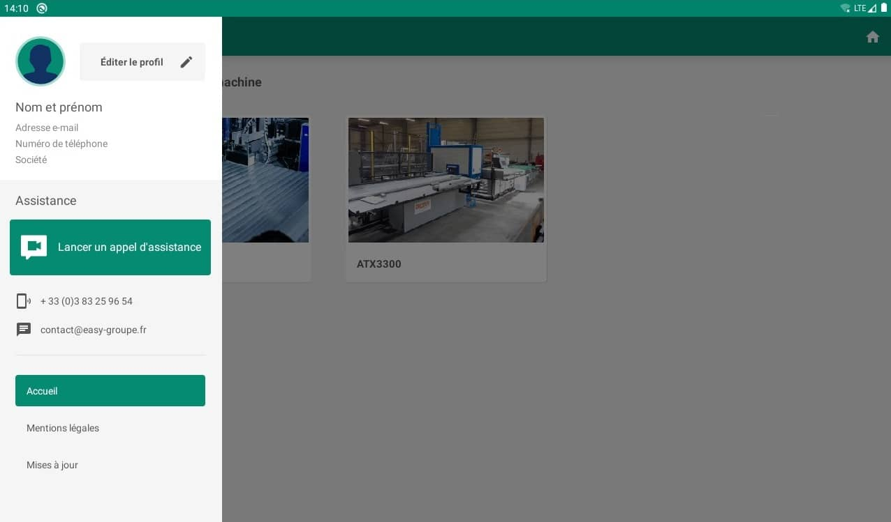
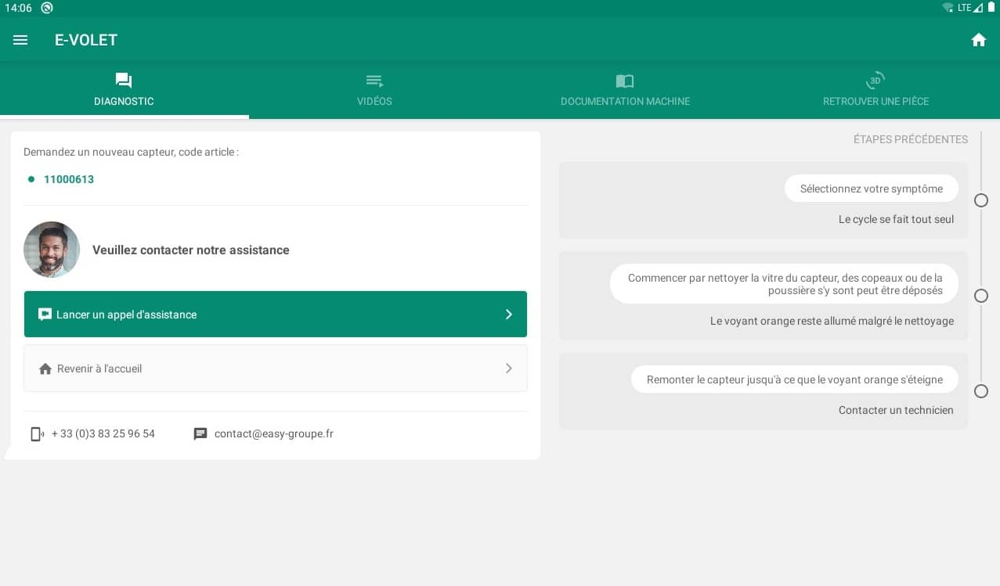
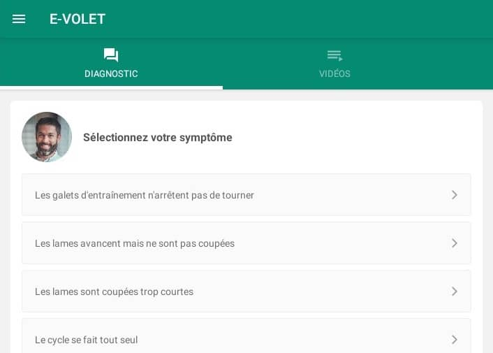

### My role

I participated technically at each stage of the project. I started it from scratch, created the initial design and worked on it until the final version of the app was released.

### Overview

[Easy-Groupe](https://easy-groupe.fr/) is a company specializing in the design and production of industrial machines. Easy RENT, one of their services, allows their customers to rent such a machine and use it for their needs. However, given the nature of these, they can sometimes break or their parts need to be replaced.

This is where the e-App comes in handy. Whenever this happens, instead of instantly reporting it to the Easy-Groupe, a machine technician can use this application, which guides its user to a solution through documentation, questions or videos. This can hopefully help troubleshoot the machine and fix the problem without any need of further actions.

The most important part of the app is similar to the Spareka's diagnostic [tool](https://www.spareka.fr/comment-reparer).

### Preview

### Challenge

The main problem that the e-App is trying to solve is the need for assistance for Easy-Groupe's customers when there is an issue with a machine. The main objective is to delay a customer's call to the company or, in the best case scenario, to get rid of it altogether.

The technician is supposed to follow different types of guides to troubleshoot the machine. Only if all the solutions provided by the app failed to fix the problem, the customer will initiate a support call to the company.

From the start, the e-App was envisioned as a hybrid mobile app. To build it, tools like [React Native](https://reactnative.dev/) or [Flutter](https://flutter.dev/) were planned to be used. Personally, I have never used any, so even before the development started, I had to do some research and eventually learn one.

Some other caveats involved a 3D model view inside the app that could allow the user to view all parts of the machine, multi-language support, or data storage for all guides.

### Solution

React Native was chosen for the app development because of its large ecosystem and because I was already familiar with [React](https://reactjs.org/), which was supposed to be an easy transition from one to the other.

As mentioned earlier, the most important part of the e-App was inspired by Spareka's diagnostic tool, where the user starts by selecting "symptoms" inside a chat-like guide. Each answer leads to a set of instructions and questions that help to narrow it down to a solution for any given problem. Once the user has reached the final step, the machine should be fixed. If the problem persists, a technician can start the support call for additional advice from Easy-Groupe.

The application also includes documentation in the form of PDF files that the user can consult at any given moment, videos with the most important manipulations presented and described in a clear manner, but also a view of the 3D model of each machine.

All content, as well as labels for the user interface, are stored in an [SQLite](https://www.sqlite.org/) database, which is a small and very fast solution for storing data. It has also been used for multi-language content management.

### Results

e-App has been successfully deployed and is now a part of Easy-Groupe's RENT service. The whole experience was interesting and quite important to me. Not only did I learn React Native, but I was also able to follow a project from start to finish, which was very educational.
